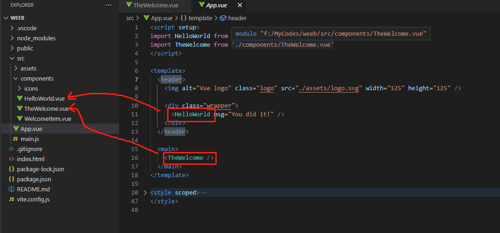

# 通过npm手脚架创建第一个vue项目
# 认识目录
最经常修改``src/components``。启动项目后，最先从``main.js``，因为那里面mount了App.vue，App里面又使用了``components``里面的其他组件。


- 在导入的时候可以用@代替/src目录前缀
- node_modules里面的文件可以直接不加路径前缀
- router可以``import router from 'vue-router'``也可以``import VueRouter from 'vue-router'``，名字不重要。
# 一些基础概念
vue项目中``src/HelloWorld.vue``等文件进行熟悉。
此节主要介绍语法。
## 应用实例
每个 Vue 应用都是通过 createApp 函数创建一个新的 应用实例：
```js
import { createApp } from 'vue'

const app = createApp({
  /* 根组件选项 */
})
```
- where is 'vue' imported from?

## 根组件
我们传入 createApp 的对象实际上是一个组件，每个应用都需要一个“根组件”，其他组件将作为其子组件。

如果你使用的是单文件组件，我们可以直接从另一个文件中导入根组件。
```js

import { createApp } from 'vue'
// 从一个单文件组件中导入根组件
import App from './App.vue'

const app = createApp(App)
```

## 挂载应用
应用实例必须在调用了 .mount() 方法后才会渲染出来。该方法接收一个“容器”参数，可以是一个实际的 DOM 元素或是一个 CSS 选择器字符串：
```html

<div id="app"></div>
```
```js

app.mount('#app')
```
- where is the '#app'?

## 多个应用实例

应用实例并不只限于一个。createApp API 允许你在同一个页面中创建多个共存的 Vue 应用，而且每个应用都拥有自己的用于配置和全局资源的作用域。
```js

const app1 = createApp({
  /* ... */
})
app1.mount('#container-1')

const app2 = createApp({
  /* ... */
})
app2.mount('#container-2')
```

# 模板语法
## 文本插值

最基本的数据绑定形式是文本插值，它使用的是“Mustache”语法 (即双大括号)：
```js

<span>Message: {{ msg }}</span>
```

以msg为变量，js中的msg 属性更改时html中的它也会同步更新。

双大括号会将数据解释为纯文本，而不是 HTML。若想插入 HTML，你需要使用 v-html 指令：
```js

<p>Using text interpolation: {{ rawHtml }}</p>
<p>Using v-html directive: <span v-html="rawHtml"></span></p>
```
**但是在网站上动态渲染任意 HTML 是非常危险的，因为这非常容易造成 XSS 漏洞。**

双大括号中支持JavaScript表达式：
```js
{{ number + 1 }}

{{ ok ? 'YES' : 'NO' }}

{{ message.split('').reverse().join('') }}

<div :id="`list-${id}`"></div>
```
在 Vue 模板内，JavaScript 表达式可以被使用在如下场景上：
- 在文本插值中 (双大括号)
- 在任何 Vue 指令 (以 v- 开头的特殊 attribute) attribute 的值中

每个绑定仅支持单一表达式，也就是一段能够被求值的 JavaScript 代码。一个简单的判断方法是是否可以合法地写在 return 后面。

因此，下面的例子都是无效的：
```js

<!-- 这是一个语句，而非表达式 -->
{{ var a = 1 }}

<!-- 条件控制也不支持，请使用三元表达式 -->
{{ if (ok) { return message } }}

```
双括号内也可以调用函数：
```js
<span :title="toTitleDate(date)">
  {{ formatDate(date) }}
</span>
```
**绑定在表达式中的方法在组件每次更新时都会被重新调用**。

[v-bind的使用场景](https://zhuanlan.zhihu.com/p/360230036)

## Attribute 绑定
#

双大括号不能在 HTML attributes 中使用。想要响应式地绑定一个 attribute，应该使用 v-bind 指令：
```js

<div v-bind:id="dynamicId"></div>
```

v-bind 指令指示 Vue 将元素的 id attribute 与组件的 dynamicId 属性保持一致。如果绑定的值是 null 或者 undefined，那么该 attribute 将会从渲染的元素上移除。

因为 v-bind 非常常用，简写语法：
```js

<div :id="dynamicId"></div>
```

## 布尔型 Attribute

布尔型 attribute 依据 true / false 值来决定 attribute 是否应该存在于该元素上。disabled 就是最常见的例子之一。

v-bind 在这种场景下的行为略有不同：
```js

<button :disabled="isButtonDisabled">Button</button>
```

当 isButtonDisabled 为真值或一个空字符串 (即 ``<button disabled="">``) 时，元素会包含这个 disabled attribute。而当其为其他假值时 attribute 将被忽略。


## 动态绑定多个值

如果你有像这样的一个包含多个 attribute 的 JavaScript 对象：
```js

data() {
  return {
    objectOfAttrs: {
      id: 'container',
      class: 'wrapper'
    }
  }
}
```
通过不带参数的 v-bind，你可以将它们绑定到单个元素上：
```js

<div v-bind="objectOfAttrs"></div>
```
## 指令 Directives
指令是带有 v- 前缀的特殊 attribute。Vue 提供了许多内置指令，包括上面我们所介绍的 v-bind 和 v-html。

指令 attribute 的期望值为一个 JavaScript 表达式 (除了少数几个例外，即之后要讨论到的 v-for、v-on 和 v-slot)。一个指令的任务是在其表达式的值变化时响应式地更新 DOM。以 v-if 为例：
```js

<p v-if="seen">Now you see me</p>
```

这里，v-if 指令会基于表达式 seen 的值的真假来移除/插入该 <p> 元素。

另一个例子是 v-on 指令，它将监听 DOM 事件：
```js

<a v-on:click="doSomething"> ... </a>

<!-- 简写 -->
<a @click="doSomething"> ... </a>
```

这里的参数是要监听的事件名称：click。v-on 的缩写是 @ 字符。


###  指令完整语法
最后，Vue中的指令语法是：


# 响应式基础
## 声明响应式状态 
vue用 data 选项来声明组件的响应式状态，所以会经常看到
```js
export default {
  data() {
    return {
      count: 1
    }
  }
```
这些返回值仅在首次创建时被返回。若所需的值还未准备好，在必要时也可以使用 null、undefined 或者其他一些值占位。

虽然也可以不用上述方法，直接向组件实例添加新属性，但这个属性也就不是响应式了。

## 声明方法

要为组件添加方法，我们需要用到 methods 选项。这样声明methods，如下方``increment``：
```js

export default {
  data() {
    return {
      count: 0
    }
  },
  methods: {
    increment() {
      this.count++
    }
  },
  mounted() {
    // 在其他方法或是生命周期中也可以调用方法
    this.increment()
  }
}
```
很多method在模板中它们常常被用作事件监听器：
```js
<button @click="increment">{{ count }}</button>
```
## DOM 更新时机

当你更改响应式状态后，DOM 会自动更新。然而，你得注意 DOM 的更新并不是同步的：Vue 将缓冲它们直到更新周期的 “下个时机” 以确保无论你进行了多少次状态更改，每个组件都只更新一次。

# Vue的computed
## 例子1
模板中的表达式虽然方便，但也只能用来做简单的操作。如果在模板中写太多逻辑，会让模板变得臃肿，难以维护。比如说，我们有这样一个包含嵌套数组的对象：
```js

export default {
  data() {
    return {
      author: {
        name: 'John Doe',
        books: [
          'Vue 2 - Advanced Guide',
          'Vue 3 - Basic Guide',
          'Vue 4 - The Mystery'
        ]
      }
    }
  }
}
```
我们想根据 author 是否已有一些书籍来展示不同的信息：
```js

<p>Has published books:</p>
<span>{{ author.books.length > 0 ? 'Yes' : 'No' }}</span>
```
这里的模板看起来有些复杂。我们必须认真看好一会儿才能明白它的计算依赖于 author.books。更重要的是，如果在模板中需要不止一次这样的计算，我们可不想将这样的代码在模板里重复好多遍。

因此我们推荐使用计算属性来描述依赖响应式状态的复杂逻辑。这是重构后的示例：
```js

export default {
  data() {
    return {
      author: {
        name: 'John Doe',
        books: [
          'Vue 2 - Advanced Guide',
          'Vue 3 - Basic Guide',
          'Vue 4 - The Mystery'
        ]
      }
    }
  },
  computed: {
    // 一个计算属性的 getter
    publishedBooksMessage() {
      // `this` 指向当前组件实例
      return this.author.books.length > 0 ? 'Yes' : 'No'
    }
  }
}
```
```js

<p>Has published books:</p>
<span>{{ publishedBooksMessage }}</span>
```
## 例子2
todo：https://cn.vuejs.org/guide/essentials/computed.html

# Class 与 Style 绑定 
## 最简单的
```js
data() {
  return {
    isActive: true,
    hasError: false
  }
}

```
```js
<div :class="{ active: isActive }"></div>
```
## 多个class
以在对象中写多个字段来操作多个 class，此外，:class 指令也可以和一般的 class attribute 同时存在。
```js
data() {
  return {
    isActive: true,
    hasError: false
  }
}
```
配合
```js
<div
  class="static"
  :class="{ active: isActive, 'text-danger': hasError }"
></div>
```

结果是：
```js
<div class="static active"></div>
```
## 可以用Object进行绑定
绑定的对象也可以直接绑定一个Object：
```js

data() {
  return {
    classObject: {
      active: true,
      'text-danger': false
    }
  }
}
```

```
<div :class="classObject"></div>
```
我们也可以绑定一个返回对象的计算属性。这是一个常见且很有用的技巧：
```js

data() {
  return {
    isActive: true,
    error: null
  }
},
computed: {
  classObject() {
    return {
      active: this.isActive && !this.error,
      'text-danger': this.error && this.error.type === 'fatal'
    }
  }
}
```
```template
<div :class="classObject"></div>
```
## 绑定数组
也可以给 :class 绑定一个数组来渲染多个 CSS class：
```js
data() {
  return {
    activeClass: 'active',
    errorClass: 'text-danger'
  }
}
```

```
<div :class="[activeClass, errorClass]"></div>
```
渲染的结果是：
```
<div class="active text-danger"></div>
```
也可以使用三元表达式：
```
<div :class="[isActive ? activeClass : '', errorClass]"></div>
```

可以样式可以是变量，vue也可以用``-``而不是驼峰命名法。
```js
<div :style="{ color: activeColor, fontSize: fontSize + 'px' }"><div>
//可以也可以用``-``
<div :style="{ 'font-size': fontSize + 'px' }"></div>
```
一般来说，想一次性绑定多个样式，可以直接用Object，这样可以使模板更加简洁：
```js
data() {
  return {
    styleObject: {
      color: 'red',
      fontSize: '13px'
    }
  }
}
```
```template
<div :style="styleObject"></div>
```
也可以用数组一下子绑定多个：
```
<div :style="[baseStyles, overridingStyles]"></div>
```
另外，在不同浏览器中，vue只会渲染适合那个浏览器的属性
```js
<div :style="{ display: ['-webkit-box', '-ms-flexbox', 'flex'] }"></div>
```
# 条件渲染

## v-if v-else-if v-else
···js
<div v-if="type === 'A'">
  A
</div>
<div v-else-if="type === 'B'">
  B
</div>
<div v-else-if="type === 'C'">
  C
</div>
<div v-else>
  Not A/B/C
</div>
···

但如果我们想要切换不止一个元素呢？在这种情况下我们可以用`` <template> ``把他们包起来，template只是一个不可见的包装器元素，最后渲染的结果并不会包含这个  元素。
```js
<template v-if="ok">
  <h1>Title</h1>
  <p>Paragraph 1</p>
  <p>Paragraph 2</p>
</template>
```
## v-show
另一个可以用来按条件显示一个元素的指令是 v-show。其用法基本一样：
```js
<h1 v-show="ok">Hello!</h1>
```
不同之处在于 v-show 会在 DOM 渲染中保留该元素；v-show 仅切换了该元素上名为 display 的 CSS 属性。
v-show 不支持在 <template> 元素上使用，也不能和 v-else 搭配使用。
# 列表渲染
# v-for
```js
data() {
  return {
    items: [{ message: 'Foo' }, { message: 'Bar' }]
  }
}

<li v-for="item in items">
  {{ item.message }}
</li>
```
另外的使用方法：
```js
data() {
  return {
    parentMessage: 'Parent',
    items: [{ message: 'Foo' }, { message: 'Bar' }]
  }
}
<li v-for="(item, index) in items">
  {{ parentMessage }} - {{ index }} - {{ item.message }}
</li>
```
对于多层嵌套的 v-for，作用域的工作方式和函数的作用域很类似。每个 v-for 作用域都可以访问到父级作用域：
···js

<li v-for="item in items">
  <span v-for="childItem in item.children">
    {{ item.message }} {{ childItem }}
  </span>
</li>
···
你也可以使用 of 作为分隔符来替代 in，这更接近 JavaScript 的迭代器语法：
template
···js
<div v-for="item of items"></div>
···

也可以使用 v-for 来遍历一个对象的所有属性。遍历的顺序会基于对该对象调用 Object.keys() 的返回值来决定。
···js

data() {
  return {
    myObject: {
      title: 'How to do lists in Vue',
      author: 'Jane Doe',
      publishedAt: '2016-04-10'
    }
  }
}
···
···

<ul>
  <li v-for="value in myObject">
    {{ value }}
  </li>
</ul>
···
可以通过提供第二个参数表示属性名 (例如 key)：
···

<li v-for="(value, key) in myObject">
  {{ key }}: {{ value }}
</li>
···
第三个参数表示位置索引：
···template

<li v-for="(value, key, index) in myObject">
  {{ index }}. {{ key }}: {{ value }}
</li>
···

另外还可以，其中n初始值从1开始而不是0开始
···
<span v-for="n in 10">{{ n }}</span>
···